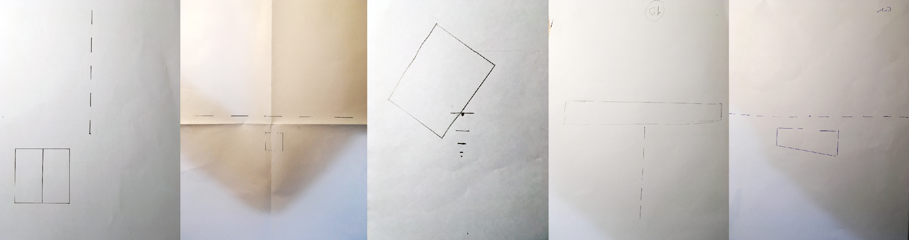

# 01 Analog Algorithms
***
###Introduction and exercise of analog algorithms 
The first step of the introduction of the theme was to define and describe an algorithm in simple words and sentences. The description should be implemented (translated) with drawings (Analog) by other students in the class. My description was difficult for some of them to decipher because my instructions were to long described and nested. In addition of that, the design of my algorithms was also to complex to design in simple sketches (see pictures).

### The Algorithm definition
Fractals are interesting and fascinating structure. They can be found in the nature in many different ways. These forms inspired me to define and describe a new algorithm for the second part of the task. My goal was to offer clear and short instructions, that help other to solve easily the artwork.

The basic idea was to concatenate simple basic shapes, which should change their size in succession. The students could independently decide how to draw the surfices in their length, but also the size and direction of the display or concatenation should be a part of the final artwork.

Fifteen students drawn the description of the algorithm. You can view the different results in the drawing below.

### The Algorithm definition
1. Use a piece of paper in any size you like (white, black, in different colors, with lines, etc.) 
2. Draw a circle with at least 5mm in diameter at any point of the side on the paper
3. Draw a square about 5mm larger than the circle area you have akready drawn before. The square and the circle must touch each other at any tangent, side or corner.
4. Draw a triangle (equilateral, square or isosceles). The surface of the triangle should be approximately 5 mm larger than the area of the square. The triangle must touch the square at any side or corner.
5. Draw a pentagon, which should be 5 mm larger than the triangle. The pentagon has to touch the triangle also at any side or corner that you prefer.
6. Repeat steps 1 to 5 till you finish an own artwork composition. Notice that the pentagon is now the starting point for the repetition because this shape was the last drawn area.
7. Fill out some of the shapes as you wish (colorful or black and white).

### Materials
The students had the task to choice the paper, drawing materials (pencils, pens, fineliner, crayons, markers, etc.) and also such as ruler, compass, etc. You can capture an overview of the diversity of the drwaings that my colleagues designed. The made experiments with different materials and colors. They have consistently chosen an A4 format for their own artwork.

### Variables/Constants/parameters
The students selected their own parameters for their artwork. A part of it was that I offered them several materials, that they could chose by themselves. Only the sequence of the algorithm definition for the artwork results should be done as I defined (see Algorithm definition) and all of them have received the same time for the production of the task. The variables were the selection of subjects: 1 lawyer, 1 marketing leader, 1 social worker, 1 manager and 10 design students. The result of the artworks are very interesting and diverse. As I could observed, they worked through the procedure very surprising and unexpected for me. Depending on the personality and ofcourse much more on the profession (various professional fields) subjects who are dealing with text, management or science, read first very concetrated and carefully the hole text. In the second step they work step by step slowlyer and sometimes more careful. They proved and checked their steps and sometimes tried to correct a part of the drawing. Designers have partially read the text, this means thet they solved the task more open and flexible.

_(1) Markus, (2) Dimitri, (3) Adina, (4) Thilo, (5) Fabian, (6) Isabell, (7) Johannah, (8) Pam, (9) Dustin, (10) Stefan, (11) Annabel, (12) Julia, (13) Niko, (14) Martin, (15) Jule_

### Criticism
Texts should be described more in note form. None long sentences but if it must be, then as simple, concise and short as possible!

### Outlook
Read, learn and practise all the extensive tips, links and literature of "generative design" that this course offers to concept and design new ideas.
***
_© Fh Potsdam · University of applied sciences · Edmundo Mejia Galindo WS2016/17 3. Semester Interface Design · Grundlagen Generative Gestaltung · Lecturer: Fabian Morón Zirfas · 10.28.2016_
